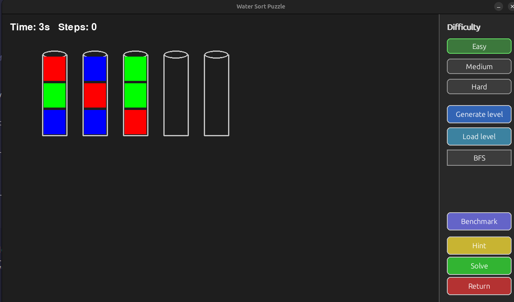

# Water Sort

### AI Assignment 1 | Group_A1_13

## Setup

**1. Create and activate a virtual environment:**

```bash
python3 -m venv .venv
source .venv/bin/activate
```

**2. Intall dependencies:**

```bash
pip install pygame
```

---

## Running the Program

From the project root directory:

```bash
python3 -m src.main
```

> Always run from the project root with `-m` so package imports resolve correctly.

## How to use



### Generating a Level

1. Select a **difficulty** (Easy / Medium / Hard) in the right panel
2. Click **"Generate level** for a random puzzle, or **"Load level"** to load from a file

- Level files must be placed in the `levels/` folder
- File format: `<difficulty>.txt` (see existing examples in that folder)

### Playing Manually

1. Click a source bottle to select it
2. Click a destination bottle to pour

If the move is valid, the water segment of the source bottle will be moved to the destination bottle.

### Solving with AI

1. Click the algorithm button, where **"BFS"** is selected by default, to open the dropdown and select an algorithm
2. If the algorihm requires a heuristic, a second dropdown will appear
3. If the algorithm requires a **weight** or **limit**, set the value in the corresponding input field
4. Choose how the AI solves:
  - **Hint** - performs the next move of the solution one step at a time
  - **Solve** - solves the full puzzle and opens a step-by-step review panel

### Saving Results

After solving with an algorithm, click **"Save results"** to export:
- Performance metrics (time, memory, states visited, solution cost)
- Initial and final board state

Saved to: `doc/solver_result_<algorithm>.txt`

### Running a Benchmark

Click **"Benchmark"** to run all algorithms on the current puzzle automatically. Results are saved to: `doc/benchmark_<difficulty>_<benchmark_count>.csv`

---

## Authors

- André Cotrim up202305592
- Dinis Noronha up202306120
- João Vila Cova up202307756
